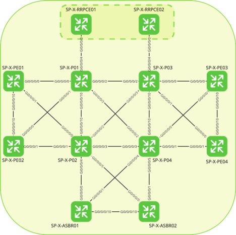

# SP-X lab creation with Terraform

This Terraform code creates a base topology to be used as a SP network. It contains PE, P, ASBR and RR-PCE devices.

Topology



Please adjust each variable to fit on your environment.

After deploying the lab and devices are running, please check if adding "crypto key generate rsa" on each device is required.

## Basic config

The following config template will be added as initial config of the devices. Please adjust them as needed on the file cml_300_nodes_xr_sp_x.tf

```abc

hostname ${each.value.hostname}
username admin
    group root-lr
    group cisco-support
    password cisco
    exit
vrf ${each.value.mgmt_vrf}
    address-family ipv4 unicast
    exit
    exit
grpc vrf ${each.value.mgmt_vrf}
interface ${each.value.mgmt_interface}
    vrf ${each.value.mgmt_vrf} 
    ipv4 address ${each.value.mgmt_ip}
    exit
router static
    vrf ${each.value.mgmt_vrf}
    address-family ipv4 unicast
    0.0.0.0/0 ${each.value.mgmt_gw}
    exit
    exit
    exit
telnet vrf ${each.value.mgmt_vrf} ipv4 server max-servers 100
telnet vrf ${each.value.mgmt_vrf} ipv6 server max-servers 100
ssh server logging
ssh server rate-limit 100
ssh server session-limit 100
ssh server v2
ssh server vrf ${each.value.mgmt_vrf}
ssh server netconf vrf ${each.value.mgmt_vrf}
end
```

## SecureCRT sessions XML

Terraform will generate a XML file with the sessions pre-configured with the values under variable xp_routers to be imported on SecureCRT.

SecureCRT > Tools > Import Settings from XML File...
Mark only Sessions and select the file "securecrt_sessions.xml" created after running "terraform apply"
